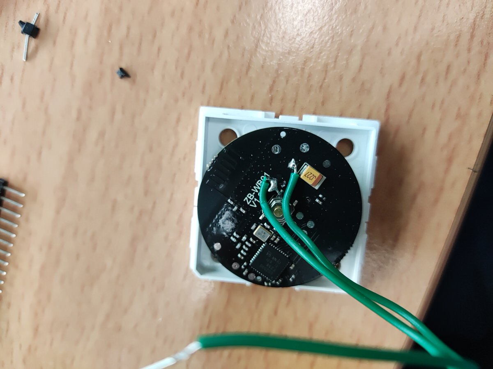
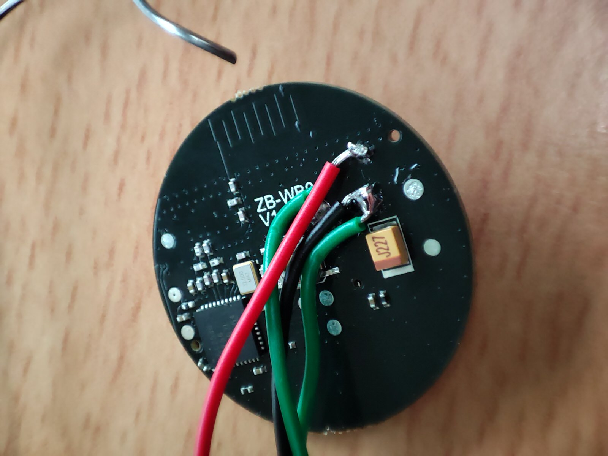
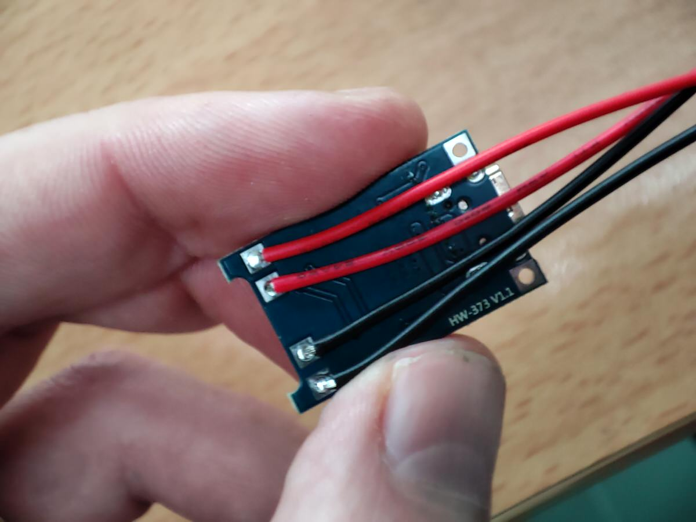
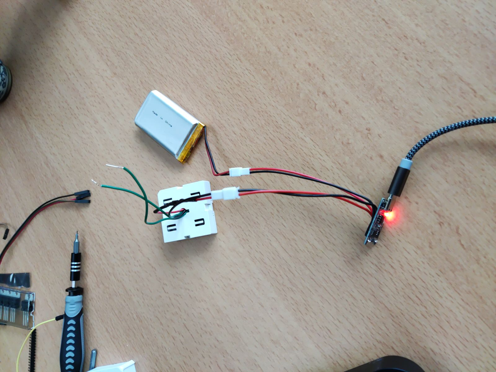
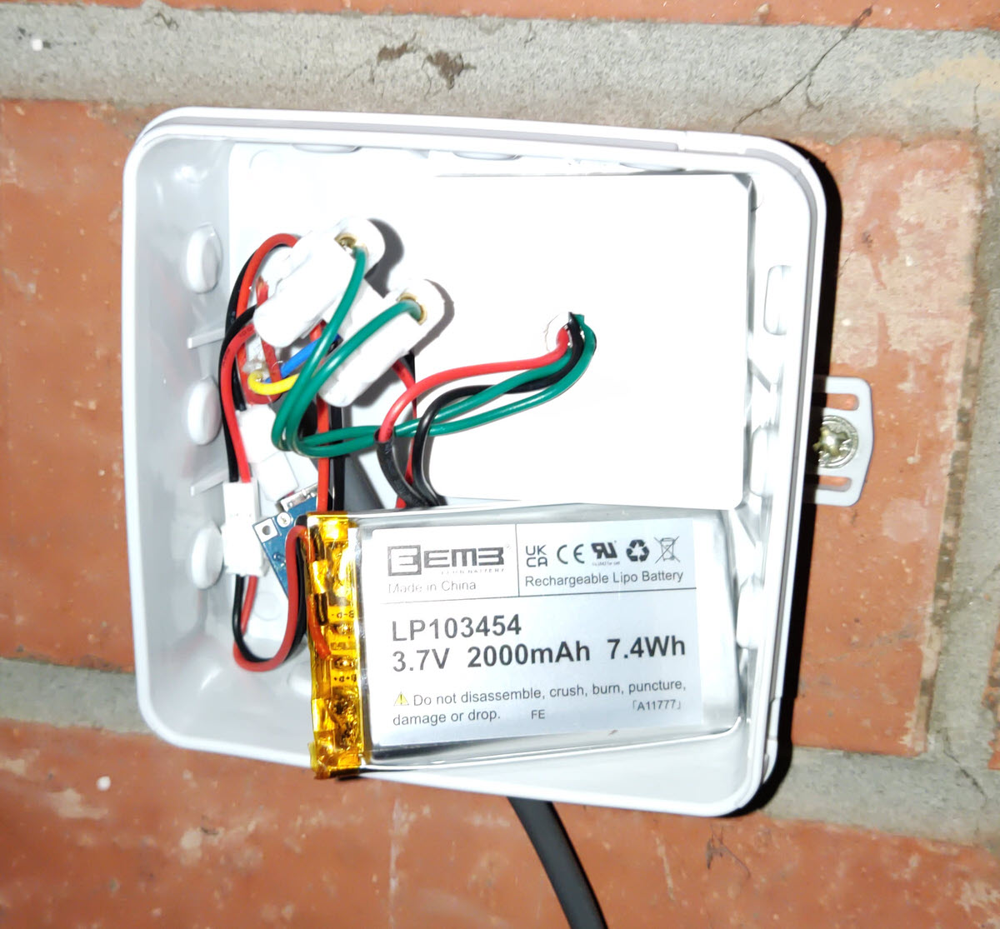

# Mesurer sa consommation de gaz
## Etape 1 : Le compteur d'impulsion
Pour pouvoir mesurer sa consommation de gaz, il est nécessaire d'avoir un compteur gaz disposant d'un aimant et pouvant accueilir un capteur d'impulsion.
Dans mon cas, il s'agit d'un Itron G4 qui dispose sur le dernier "6" d'un aimant et j'ai trouvé ce [capteur de la même marque qui s'adapte parfaitement](https://www.compteur-energie.com/gaz-emetteur-impulsions-itron-rf1.htm).

### Cablage
Le cablage au niveau du compteur est très simple, il suffit de brancher le fil rouge sur le bouton rouge du compteur et le fil noir sur le bouton noir du compteur ... non, en fait il n'y a même pas de couleur, il suffit de brancher deux fils sur les borniers à l'arrière du capteur et de le placer dans son emplacement.


## Etape 2 : Le bouton poussoir
Pour récupérer les impulsions, il y a plusieurs solutions, mais la plus "simple" est d'utiliser un bouton poussoir. Dans mon cas, je suis en ZigBee et j'ai donc utilisé le bouton poussoir [Sonoff SNZB-01](https://www.zigbee2mqtt.io/devices/SNZB-01.html) qui permet de récupérer les impulsions.

Je l'ai ouvert complètement et j'ai été rechercher les deux points de soudure qui permettent d'ajouter deux fils en parallèle avec le bouton. J'en ai profité pour forer un trou dans le dessus du bouton pour pouvoir y passer les fils. Là aussi, il n'y a pas de couleur, il suffit de brancher les fils sur les deux points de soudure.



### Cablage
Une fois les deux fils branchés, il suffit de les connecter au capteur d'impulsion. Je ne vais pas vous refaire la blague, de nouveau, il n'y a pas de couleur :)


## Etape 3 : La box domotique
Peu importe la box domotique que vous utilisez, le principe est toujours le même : récupérer les impulsions et les convertir en m3 de gaz consommé.

Sur mon compteur, un tour de la dernière roue correspond à 0.01 m3 de gaz consommé. Il faut donc d'additionner 0.01 m3 à chaque impulsion reçue pour avoir la consommation en m3.

### Version Home Assistant - Node Red
Pour ma part, j'utilise Node-Red et Home Assistant, j'ai donc créé un compteur dans les Helpers de Home Assistant et j'ai créé un flow Node-Red qui récupère les impulsions et qui ajoute 0.01 m3 à chaque impulsion reçue via l'appel du service `counter.increment` de Home Assistant.


```json
[{"id":"786821d1b18fd216","type":"server-state-changed","z":"106cf0db58f8d53d","name":"Impulsion Gaz","server":"af11678a.3c0e98","version":4,"exposeToHomeAssistant":false,"haConfig":[{"property":"name","value":""},{"property":"icon","value":""}],"entityidfilter":"sensor.impulsion_gaz_action","entityidfiltertype":"exact","outputinitially":false,"state_type":"str","haltifstate":"\"\"","halt_if_type":"jsonata","halt_if_compare":"is_not","outputs":2,"output_only_on_state_change":true,"for":"0","forType":"num","forUnits":"minutes","ignorePrevStateNull":false,"ignorePrevStateUnknown":false,"ignorePrevStateUnavailable":false,"ignoreCurrentStateUnknown":false,"ignoreCurrentStateUnavailable":false,"outputProperties":[{"property":"payload","propertyType":"msg","value":"","valueType":"entityState"},{"property":"data","propertyType":"msg","value":"","valueType":"eventData"},{"property":"topic","propertyType":"msg","value":"","valueType":"triggerId"}],"x":170,"y":680,"wires":[["6efe4b92bbcc494c"],[]]},{"id":"6efe4b92bbcc494c","type":"api-call-service","z":"106cf0db58f8d53d","name":"Increment Gaz","server":"af11678a.3c0e98","version":5,"debugenabled":false,"domain":"counter","service":"increment","areaId":[],"deviceId":[],"entityId":["counter.compteur_gaz"],"data":"","dataType":"jsonata","mergeContext":"","mustacheAltTags":false,"outputProperties":[],"queue":"none","x":440,"y":680,"wires":[[]]},{"id":"af11678a.3c0e98","type":"server","name":"Home Assistant","version":2,"addon":true,"rejectUnauthorizedCerts":true,"ha_boolean":"y|yes|true|on|home|open","connectionDelay":true,"cacheJson":true,"heartbeat":false,"heartbeatInterval":30}]
```

#### La petite astuce :)
Le compteur est incrémenté de 1, unité minimale dans un compteur, mais on veut incrémenter de 0.01 m3. J'ai donc créé un sensor de type template, qui va multiplier la valeur du compteur par 0.01 pour avoir la consommation en m3.

```yaml
- name: Consommation Gaz Totale
  unique_id: gaz_total_consumption
  state_class: total_increasing
  device_class: gas
  unit_of_measurement: m³
  state: >
    {{ states('counter.compteur_gaz') | float / 100  | round(2) }}
```

# Résultat
Et tadaaaaaaaaaaaaaaaaaaaaaaa, c'est tout :)


# Le petit plus : le up de batterie

Bon, ce bouton poussoir c'est une pile CR2450 qui n'est pas la moins chère du monde. J'ai donc décidé de faire un petit up de batterie pour pouvoir le recharger via un chargeur USB :)

## Quelle batterie ?
J'ai décidé de choisir une batterie [LiPo 3.7v 2000mAh](https://amzn.to/3NdkMv9) et de commande un [petit module USB-C](https://amzn.to/445z72Q) qui va bien pour la recharger.

## Le montage, c'est parti !
Bon, allez, on est reparti pour souder des fils :)

C'est un peu plus touchy parce que la masse est au même endroit qu'un des fils de contacts, mais ça se fait !
L'autre fil est soudé sur une petite borne reliée au + de la pile.
Ca donne ceci (pas de critique sur mes soudures :), j'ai utilisé des connecteurs [JST-PH 2.0](https://amzn.to/41T5LU9) comme sur la batterie pour pouvoir la changer facilement.



## Le chargeur de batterie
C'est tout à fait utilisable en connectant la batterie au JST mais j'ai préféré mettre en parallele un chargeur USB-C pour pouvoir le recharger sans avoir à retirer la batterie, j'ai une prise pas loin.

La connection se fait en soudant les fils qui vont vers le bouton poussoir sur les connecteurs extérieurs du chargeur et les fils vers la batterie sur les connecteurs intérieurs. **Attention, il faut bien respecter le sens des fils, le + de la batterie doit être relié au + du chargeur et la masse de la batterie au - du chargeur.**



On vérifie au multimètre que tout est bien branché comme il faut et on met en charge, c'est parti !
Et quand on a vérifié que tout fonctionne, on cale tout dans la boite de dérivation et on remonte le tout sur le capteur du compteur.

*J'ai quand même mis une diode entre sur le positif, pour éviter les inversions de polarité et dropper de 0.7V car la batterie est à 3.7V (4.2 en charge) alors que la pile est à 3V. A priori, le bouton poussoir le tolère :)*


