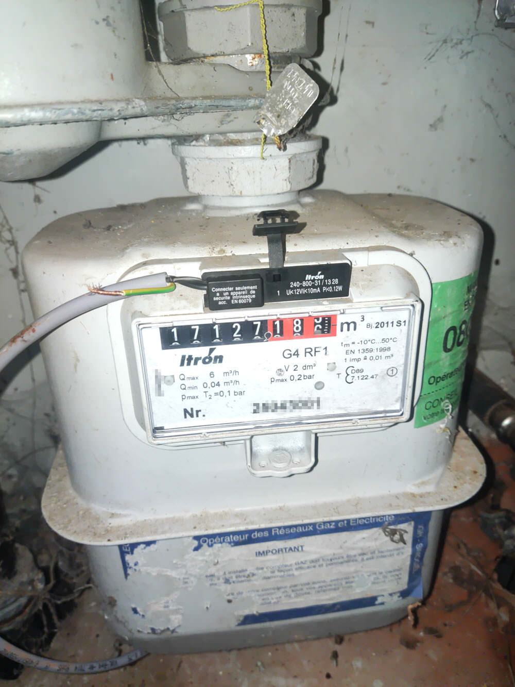
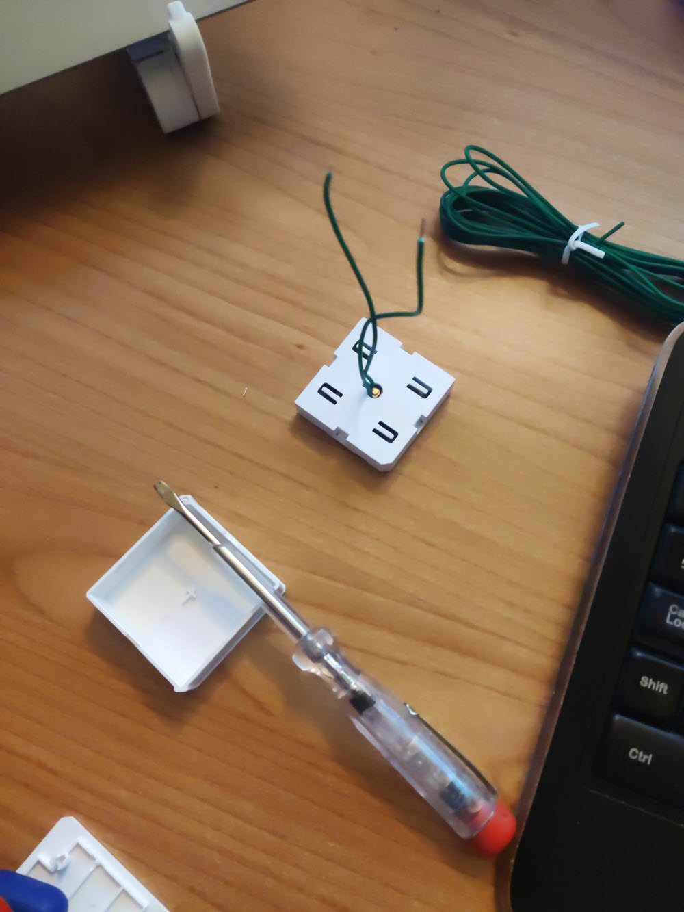
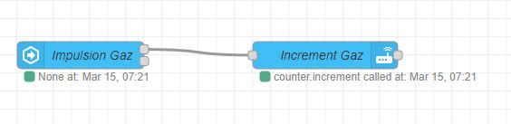
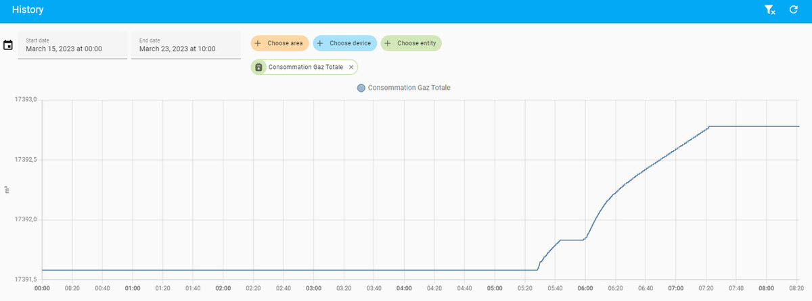

# Mesurer sa consommation de gaz
## Etape 1 : Le compteur d'impulsion
Pour pouvoir mesurer sa consommation de gaz, il est nécessaire d'avoir un compteur gaz disposant d'un aimant et pouvant accueilir un capteur d'impulsion.
Dans mon cas, il s'agit d'un Itron G4 qui dispose sur le dernier "6" d'un aimant et j'ai trouvé ce [capteur de la même marque qui s'adapte parfaitement](https://www.compteur-energie.com/gaz-emetteur-impulsions-itron-rf1.htm).

### Cablage
Le cablage au niveau du compteur est très simple, il suffit de brancher le fil rouge sur le bouton rouge du compteur et le fil noir sur le bouton noir du compteur ... non, en fait il n'y a même pas de couleur, il suffit de brancher deux fils sur les borniers à l'arrière du capteur et de le placer dans son emplacement.



## Etape 2 : Le bouton poussoir
Pour récupérer les impulsions, il y a plusieurs solutions, mais la plus "simple" est d'utiliser un bouton poussoir. Dans mon cas, je suis en ZigBee et j'ai donc utilisé le bouton poussoir [Sonoff SNZB-01](https://www.zigbee2mqtt.io/devices/SNZB-01.html) qui permet de récupérer les impulsions.

Je l'ai ouvert complètement et j'ai été rechercher les deux points de soudure qui permettent d'ajouter deux fils en parallèle avec le bouton. (photo à venir). J'en ai profité pour forer un trou dans le dessus du bouton pour pouvoir y passer les fils. Là aussi, il n'y a pas de couleur, il suffit de brancher les fils sur les deux points de soudure.

### Cablage
Une fois les deux fils branchés, il suffit de les connecter au capteur d'impulsion. Je ne vais pas vous refaire la blague, de nouveau, il n'y a pas de couleur :)



## Etape 3 : La box domotique
Peu importe la box domotique que vous utilisez, le principe est toujours le même : récupérer les impulsions et les convertir en m3 de gaz consommé.

Sur mon compteur, un tour de la dernière roue correspond à 0.01 m3 de gaz consommé. Il faut donc d'additionner 0.01 m3 à chaque impulsion reçue pour avoir la consommation en m3.

### Version Home Assistant - Node Red
Pour ma part, j'utiliser Node-Red et Home Assistant, j'ai donc créé un compteur dans les Helpers de Home Assistant et j'ai créé un flow Node-Red qui récupère les impulsions et qui ajoute 0.01 m3 à chaque impulsion reçue via l'appel du service `counter.increment` de Home Assistant.



```json
[{"id":"786821d1b18fd216","type":"server-state-changed","z":"106cf0db58f8d53d","name":"Impulsion Gaz","server":"af11678a.3c0e98","version":4,"exposeToHomeAssistant":false,"haConfig":[{"property":"name","value":""},{"property":"icon","value":""}],"entityidfilter":"sensor.impulsion_gaz_action","entityidfiltertype":"exact","outputinitially":false,"state_type":"str","haltifstate":"\"\"","halt_if_type":"jsonata","halt_if_compare":"is_not","outputs":2,"output_only_on_state_change":true,"for":"0","forType":"num","forUnits":"minutes","ignorePrevStateNull":false,"ignorePrevStateUnknown":false,"ignorePrevStateUnavailable":false,"ignoreCurrentStateUnknown":false,"ignoreCurrentStateUnavailable":false,"outputProperties":[{"property":"payload","propertyType":"msg","value":"","valueType":"entityState"},{"property":"data","propertyType":"msg","value":"","valueType":"eventData"},{"property":"topic","propertyType":"msg","value":"","valueType":"triggerId"}],"x":170,"y":680,"wires":[["6efe4b92bbcc494c"],[]]},{"id":"6efe4b92bbcc494c","type":"api-call-service","z":"106cf0db58f8d53d","name":"Increment Gaz","server":"af11678a.3c0e98","version":5,"debugenabled":false,"domain":"counter","service":"increment","areaId":[],"deviceId":[],"entityId":["counter.compteur_gaz"],"data":"","dataType":"jsonata","mergeContext":"","mustacheAltTags":false,"outputProperties":[],"queue":"none","x":440,"y":680,"wires":[[]]},{"id":"af11678a.3c0e98","type":"server","name":"Home Assistant","version":2,"addon":true,"rejectUnauthorizedCerts":true,"ha_boolean":"y|yes|true|on|home|open","connectionDelay":true,"cacheJson":true,"heartbeat":false,"heartbeatInterval":30}]
```

# Résultat
Et tadaaaaaaaaaaaaaaaaaaaaaaa, c'est tout :)

